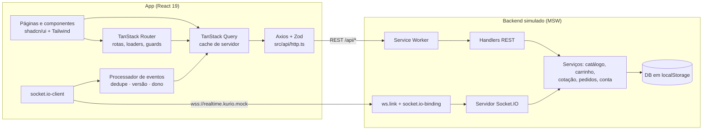
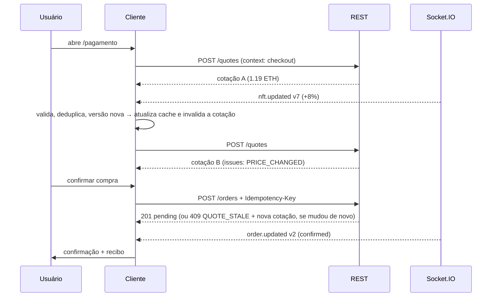

# Arquitetura — KURIO

Documento técnico da solução do desafio "Marketplace de NFTs". O [README](README.md) cobre setup,
comandos, contas de teste e roteiros para reproduzir cada fluxo de falha.

1. [Visão geral](#1-visão-geral)
2. [Organização do código e rotas](#2-organização-do-código-e-rotas)
3. [Contratos REST](#3-contratos-rest)
4. [Eventos em tempo real (Socket.IO)](#4-eventos-em-tempo-real-socketio)
5. [Política de sessão](#5-política-de-sessão)
6. [Estado do carrinho](#6-estado-do-carrinho)
7. [Checkout, pedidos e idempotência](#7-checkout-pedidos-e-idempotência)
8. [Cache, retries e erros](#8-cache-retries-e-erros)
9. [Reconciliação REST ↔ Socket.IO](#9-reconciliação-rest--socketio)
10. [Backend simulado (MSW)](#10-backend-simulado-msw)
11. [Chaos Lab](#11-chaos-lab)
12. [Acessibilidade](#12-acessibilidade)
13. [Performance e Lighthouse](#13-performance-e-lighthouse)
14. [Decisões de UX](#14-decisões-de-ux)
15. [Desvios do Figma e substituições de assets](#15-desvios-do-figma-e-substituições-de-assets)
16. [Limitações conhecidas e próximos passos](#16-limitações-conhecidas-e-próximos-passos)

---

## 1. Visão geral



Princípios que guiaram a implementação:

- **Contrato primeiro.** Os schemas Zod em [`src/contracts`](src/contracts) são a fonte única de tipos
  para o cliente e para os mocks. Toda resposta é validada na borda (`apiRequest(schema, config)`):
  um backend fora do contrato falha cedo, com erro claro, em vez de quebrar a UI longe da causa.
- **O servidor é a fonte de verdade.** Preço, disponibilidade, totais, cupons e status do pedido são
  calculados pelo backend. O cliente exibe, faz atualizações otimistas reversíveis e reconcilia.
- **A UI não conhece o mock.** O app só conversa com REST e Socket.IO. Com `VITE_ENABLE_MOCKS=false`
  e `VITE_API_URL`/`VITE_SOCKET_URL` apontando para um backend real, nenhum código muda. O MSW é
  importado dinamicamente e fica em um chunk próprio.
- **Organização por domínio.** Cada feature em `src/features/<domínio>` tem `api.ts` (chamadas
  tipadas), `queries.ts` (query options e mutations), componentes e páginas. Os arquivos de
  `src/routes` só declaram rota, loader, guard e metadados.

## 2. Organização do código e rotas

```
src/
├── api/          Axios (interceptors, ApiError), QueryClient e fábrica de query keys
├── app/          criação do router e metadados de rota (cabeçalho mobile, tab bar)
├── components/   layout (header, top bar e tab bar mobile, footer), estados de página e ui/ (shadcn/ui)
├── contracts/    schemas Zod, rotas REST, cabeçalhos e eventos (compartilhados com os mocks)
├── features/
│   ├── account/    perfil, avatar, senha, carteiras e histórico
│   ├── auth/       login, cadastro, sessão e ciclo de vida da sessão
│   ├── cart/       carrinho, cupom e resumo (cotação)
│   ├── catalog/    início: hero, destaques, busca, filtros, ordenação e paginação
│   ├── checkout/   pagamento, revisão e criação idempotente do pedido
│   ├── devtools/   Chaos Lab
│   ├── favorites/  favoritos com atualização otimista
│   ├── nft/        detalhe: galeria, edições, quantidade e relacionados
│   ├── orders/     status do pedido, confirmação e aviso de pedido pendente
│   └── realtime/   conexão Socket.IO, processador e log de eventos
├── lib/          ETH com big.js, storage seguro, foco, media query, redirect seguro…
├── mocks/        backend simulado (seção 10)
└── routes/       rotas file-based do TanStack Router (`_auth` = rotas privadas)
```

| Rota               | Tela (Figma)                                | Acesso                         |
| ------------------ | ------------------------------------------- | ------------------------------ |
| `/`                | Início: catálogo, destaques, busca, filtros | pública                        |
| `/nft/$nftId`      | Detalhe do NFT                              | pública                        |
| `/carrinho`        | Carrinho                                    | pública (visitante ou conta)   |
| `/entrar`          | Login (modal sobre o início no desktop)     | pública                        |
| `/cadastro`        | Cadastro                                    | pública                        |
| `/pagamento`       | Pagamento e revisão                         | privada                        |
| `/pedido/$orderId` | Confirmação e status do pedido              | privada (só o dono)            |
| `/transacao/$hash` | Recibo da transação (link do "explorer")    | privada (só o dono)            |
| `/conta/perfil`    | Perfil                                      | privada (`/conta` redireciona) |
| `/conta/carteiras` | Carteiras                                   | privada                        |
| `/conta/favoritos` | Favoritos                                   | privada                        |
| `/em-breve/$secao` | Itens de menu sem tela no Figma             | pública                        |

Os filtros, a busca, a ordenação e a página do catálogo ficam na URL (search params validados com
Zod em `validateSearch`). Assim, o link é compartilhável e voltar/avançar funciona.

## 3. Contratos REST

Convenções:

- Base `VITE_API_URL` (padrão `/api`), JSON, datas ISO-8601 em UTC.
- **Valores em ETH são strings decimais** (até 18 casas, ex.: `"1.19"`), e toda a aritmética usa
  `big.js` ([`src/lib/eth.ts`](src/lib/eth.ts)). Nunca usamos `number` para dinheiro.
- Autenticação: `Authorization: Bearer <token>`. Carrinho de visitante: `X-Cart-Id: <uuid>`.
- Recursos mutáveis (NFT, carrinho, pedido) têm `version` monotônica, usada na reconciliação com
  eventos (seção 9).
- Erro padronizado, com `retryable` indicando se repetir a mesma requisição pode funcionar:

```json
{
  "error": {
    "code": "QUOTE_STALE",
    "message": "A rede mudou desde a cotação. Revise os valores.",
    "status": 409,
    "retryable": false,
    "requestId": "req_k2d9x1",
    "fields": { "email": "Este e-mail já está em uso" },
    "details": { "quote": { "...": "nova cotação" } }
  }
}
```

| Método         | Rota                           | Auth                       | Descrição                                                                                                                                                                                        | Erros principais                                                                                                                                                                  |
| -------------- | ------------------------------ | -------------------------- | ------------------------------------------------------------------------------------------------------------------------------------------------------------------------------------------------ | --------------------------------------------------------------------------------------------------------------------------------------------------------------------------------- |
| POST           | `/auth/register`               | —                          | Cria a conta e abre sessão (`{ token, session }`)                                                                                                                                                | 422 `VALIDATION_ERROR`, 409 `EMAIL_TAKEN` / `USERNAME_TAKEN`                                                                                                                      |
| POST           | `/auth/login`                  | —                          | Abre sessão                                                                                                                                                                                      | 401 `INVALID_CREDENTIALS`                                                                                                                                                         |
| GET            | `/auth/session`                | Bearer                     | Confirma o token e devolve usuário e `expiresAt`                                                                                                                                                 | 401 `SESSION_EXPIRED` / `UNAUTHENTICATED`                                                                                                                                         |
| POST           | `/auth/logout`                 | Bearer                     | Encerra a sessão                                                                                                                                                                                 | —                                                                                                                                                                                 |
| GET            | `/nfts`                        | —                          | Lista paginada. Parâmetros: `q`, `category` (repetível), `network` (repetível), `minPrice`, `maxPrice`, `tab`, `sort`, `page`, `pageSize` (≤ 48). Retorna itens, paginação e contagem por faceta | 422 `VALIDATION_ERROR`                                                                                                                                                            |
| GET            | `/nfts/highlights`             | —                          | NFT em destaque e "em alta"                                                                                                                                                                      | —                                                                                                                                                                                 |
| GET            | `/nfts/:id`                    | —                          | Detalhe com edições, galeria, criador, atributos e avaliações                                                                                                                                    | 404 `NOT_FOUND`                                                                                                                                                                   |
| GET            | `/nfts/:id/related`            | —                          | Relacionados                                                                                                                                                                                     | 404 `NOT_FOUND`                                                                                                                                                                   |
| GET            | `/me/favorites`                | Bearer                     | Favoritos do usuário                                                                                                                                                                             | 401                                                                                                                                                                               |
| PUT / DELETE   | `/me/favorites/:nftId`         | Bearer                     | Inclui ou remove (idempotente)                                                                                                                                                                   | 401, 404                                                                                                                                                                          |
| GET            | `/cart`                        | Bearer ou `X-Cart-Id`      | Carrinho atual, com `version` e pendências por linha                                                                                                                                             | —                                                                                                                                                                                 |
| POST           | `/cart/items`                  | Bearer ou `X-Cart-Id`      | Adiciona `{ nftId, editionId, quantity }`                                                                                                                                                        | 409 `EDITION_UNAVAILABLE` / `OUT_OF_STOCK`, 422 `LIMIT_EXCEEDED`                                                                                                                  |
| PATCH / DELETE | `/cart/items/:lineId`          | Bearer ou `X-Cart-Id`      | Altera a quantidade ou remove a linha                                                                                                                                                            | 409 `OUT_OF_STOCK`, 422 `LIMIT_EXCEEDED`, 404                                                                                                                                     |
| PUT / DELETE   | `/cart/coupon`                 | Bearer ou `X-Cart-Id`      | Aplica ou remove o cupom                                                                                                                                                                         | 422 `COUPON_INVALID` / `COUPON_EXPIRED`, 409 `CART_EMPTY`                                                                                                                         |
| POST           | `/cart/acknowledge`            | Bearer ou `X-Cart-Id`      | Registra que o usuário viu as mudanças de preço ou estoque sinalizadas                                                                                                                           | —                                                                                                                                                                                 |
| POST           | `/cart/merge`                  | Bearer                     | Mescla o carrinho de visitante (`{ guestCartId }`) no da conta após o login                                                                                                                      | —                                                                                                                                                                                 |
| POST           | `/quotes`                      | Bearer ou `X-Cart-Id`      | Cotação do carrinho para `{ network, context }`: subtotal, desconto, taxa de rede, total, `issues`, `purchasable`, `expiresAt`                                                                   | 400 `BAD_REQUEST`                                                                                                                                                                 |
| POST           | `/orders`                      | Bearer + `Idempotency-Key` | Cria o pedido `{ quoteId, walletId, provider, network, buyer }` → 201 `pending`. Replay devolve o mesmo pedido com `Idempotent-Replayed: true`                                                   | 400 `IDEMPOTENCY_KEY_REQUIRED`, 409 `QUOTE_STALE` (nova cotação em `details`) / `QUOTE_EXPIRED` / `OUT_OF_STOCK` / `CART_EMPTY` / `IDEMPOTENCY_CONFLICT` / `WALLET_NOT_CONNECTED` |
| GET            | `/orders`, `/orders/:id`       | Bearer                     | Histórico e pedido                                                                                                                                                                               | 404 `NOT_FOUND`, 403 `FORBIDDEN` (pedido de outra conta)                                                                                                                          |
| GET            | `/orders/by-transaction/:hash` | Bearer                     | Pedido pela transação (recibo)                                                                                                                                                                   | 404 `NOT_FOUND`, 403 `FORBIDDEN`                                                                                                                                                  |
| GET / PATCH    | `/me/profile`                  | Bearer                     | Perfil público e dados da conta                                                                                                                                                                  | 422 `VALIDATION_ERROR`, 409 `USERNAME_TAKEN` / `EMAIL_TAKEN`                                                                                                                      |
| PUT / DELETE   | `/me/avatar`                   | Bearer                     | Avatar (redimensionado no cliente antes do envio)                                                                                                                                                | 422 `VALIDATION_ERROR`                                                                                                                                                            |
| POST           | `/me/password`                 | Bearer                     | Troca de senha                                                                                                                                                                                   | 422 `INVALID_PASSWORD`                                                                                                                                                            |
| GET / POST     | `/me/wallets`                  | Bearer                     | Lista ou adiciona carteira                                                                                                                                                                       | 409 `WALLET_SLOT_TAKEN` / `WALLET_ADDRESS_TAKEN`                                                                                                                                  |
| PUT            | `/me/wallets/:id`              | Bearer                     | Edita a carteira                                                                                                                                                                                 | 409 `WALLET_ADDRESS_TAKEN`, 404                                                                                                                                                   |
| POST / DELETE  | `/me/wallets/:id/connection`   | Bearer                     | Conecta (simula a aprovação na extensão) ou desconecta                                                                                                                                           | 403 `WALLET_REJECTED`                                                                                                                                                             |

Além desses, qualquer rota pode responder 400 `BAD_REQUEST` (corpo inválido ou `X-Cart-Id`
ausente), 401 (sessão), 429, 500 ou 503 (`retryable: true`), ou falhar na camada de rede. Os
cenários do mock reproduzem esses casos.

## 4. Eventos em tempo real (Socket.IO)

- Conexão: `io(VITE_SOCKET_URL, { transports: ['websocket'], auth: { token } })`. Há uma conexão
  por sessão: o visitante conecta sem token e recebe só eventos públicos. Ao trocar de usuário, a
  conexão anterior é encerrada antes de a nova abrir.
- Envelope comum: `id` (identidade estável, usada na deduplicação), `type`, `resource { type, id }`,
  `version` (monotônica por recurso) e `occurredAt`.

| Evento          | Entrega                                      | `data`                                                                                                                                                           | Efeito no cliente                                                                                                                                |
| --------------- | -------------------------------------------- | ---------------------------------------------------------------------------------------------------------------------------------------------------------------- | ------------------------------------------------------------------------------------------------------------------------------------------------ |
| `nft.updated`   | broadcast                                    | `nftId`, `name`, `reason` (`price_change` \| `availability_change`), `price`, `compareAtPrice`, `available`, `editions[{ id, price, previousPrice, available }]` | Atualiza detalhe, listas, destaques, relacionados e favoritos no cache. Se o NFT está no carrinho, invalida carrinho e cotação e avisa o usuário |
| `order.updated` | só para os sockets do dono (inclui `userId`) | `orderId`, `status` (`pending` \| `confirmed` \| `declined`), `failureReason`, `updatedAt`                                                                       | Atualiza o pedido e busca o recibo. Na confirmação, invalida carrinho e cotação                                                                  |

```json
{
  "id": "evt_000183",
  "type": "nft.updated",
  "resource": { "type": "nft", "id": "emerald-ape-042" },
  "version": 7,
  "occurredAt": "2026-10-07T14:03:12.000Z",
  "data": {
    "nftId": "emerald-ape-042",
    "name": "Emerald Ape #042",
    "reason": "price_change",
    "price": "1.2852",
    "compareAtPrice": null,
    "available": 12,
    "editions": [{ "id": "standard", "price": "1.2852", "previousPrice": "1.19", "available": 12 }]
  }
}
```

## 5. Política de sessão

- **Token opaco com expiração absoluta.** O padrão é 1 h; o cenário `session-expiring` usa 45 s. O
  token fica em `localStorage` (`kurio:session`) para sobreviver ao refresh, mas a sessão "verdadeira"
  é sempre a do servidor: no boot, `GET /auth/session` confirma usuário e expiração.
- **Rotas privadas** ficam sob o layout `_auth`. O `beforeLoad` verifica a sessão e, sem ela, envia
  para `/entrar?redirect=<rota atual>`. O `redirect` é validado ([`safe-redirect.ts`](src/lib/safe-redirect.ts):
  só caminhos internos), o que evita open redirect.
- **Expiração.** Um 401 `SESSION_EXPIRED`/`UNAUTHENTICATED` em requisição autenticada encerra a
  sessão local. Os dados privados são removidos do cache, mas o rascunho do checkout é mantido. Em
  rota privada, o usuário vai para o login com `redirect` e um aviso. Depois de entrar de novo, volta
  ao mesmo ponto, e o rascunho do checkout é restaurado se o usuário for o mesmo. Uma verificação
  proativa também é agendada para o `expiresAt`.
- **Logout.** `POST /auth/logout` e limpeza completa: caches privados, rascunho e tentativa de
  checkout, socket da sessão.
- **Troca de usuário sem vazamento.** Dados privados ficam sob `['user', userId, …]` e o carrinho sob
  `['cart', 'user:<id>' | 'guest:<id>']`. Ao autenticar, os dados da sessão anterior são removidos
  antes de registrar a nova, o socket anterior é fechado e o processador esquece as versões de
  pedidos. O Playwright cobre a troca A → B.
- **Múltiplas abas.** Login e logout em outra aba chegam pelo evento `storage` e disparam a
  revalidação.

## 6. Estado do carrinho

- **O carrinho é estado de servidor** (TanStack Query, sem store global): `GET /cart` é a fonte de
  verdade, para visitante (`X-Cart-Id`, UUID persistido em `kurio:guest-cart`) e para conta. Ele
  sobrevive a refresh e é compartilhado entre abas.
- **Visitante → login.** `POST /cart/merge` soma as linhas do visitante no carrinho da conta,
  respeitando disponibilidade e limites. Depois, um novo `X-Cart-Id` é gerado, para o carrinho antigo
  não reaparecer para outra pessoa no mesmo navegador.
- **Atualizações otimistas** de quantidade e remoção, serializadas por carrinho
  (`scope: cart:<dono>`). Cliques rápidos não chegam fora de ordem, falhas revertem o cache e a
  remoção oferece "Desfazer". Quando a última mutation em voo termina, um refetch alinha o cache com
  o servidor sem "piscar" estados intermediários.
- **Totais vêm da cotação.** `POST /quotes`, com a chave `['quote', dono, { cartVersion, network, context }]`,
  calcula subtotal, desconto, taxa de rede e total no servidor. O cliente nunca soma preços. Uma
  mudança no carrinho (`version`) ou na rede gera uma nova cotação.
- **Mudanças de mercado.** O servidor marca cada linha afetada com `PRICE_CHANGED`,
  `INSUFFICIENT_AVAILABILITY` ou `SOLD_OUT` (com preço anterior e atual). A UI destaca a linha e pede
  ciência (`POST /cart/acknowledge`), e itens esgotados bloqueiam o checkout (`purchasable: false`).
- **Cupons:** `KURIO10` (10%), `GENESIS` (0.05 ETH acima de 0.5 ETH) e `VERAO2025` (expirado).

## 7. Checkout, pedidos e idempotência



- **Fluxo:** carrinho → `/pagamento` (comprador, carteira e rede; o rascunho fica no `sessionStorage`
  por usuário) → revisão com a cotação de checkout → `POST /orders` → `/pedido/$orderId` (pendente →
  confirmado ou recusado) → recibo em `/transacao/$hash`.
- **Chave de idempotência por tentativa,** guardada no `sessionStorage` (`kurio:checkout-attempt`) com
  o hash do payload. Clique duplo, retry após timeout e até um refresh reutilizam a mesma chave. Se o
  payload muda (por exemplo, uma nova cotação), a chave também muda.
- **No servidor:** mesma chave e mesmo payload devolvem o mesmo pedido (`Idempotent-Replayed: true`).
  Mesma chave com payload diferente responde 409 `IDEMPOTENCY_CONFLICT`. Requisições concorrentes com
  a mesma chave são serializadas, como um lock de banco.
- **No cliente:** botão desabilitado e guarda síncrona contra envio duplo. O timeout é de 8 s, com
  até 2 retries com backoff para erros transitórios, o que é seguro por causa da chave. O estado de
  "processando" é preservado mesmo se o carrinho esvaziar no meio do caminho.
- **Validação final no servidor.** A cotação tem validade e é recalculada no `POST /orders`. Se preço
  ou disponibilidade mudaram, a resposta é 409 `QUOTE_STALE` com a nova cotação em `details` (a UI
  mostra "antes × depois" e exige nova confirmação) ou `OUT_OF_STOCK`.
- **Reserva e resolução assíncrona.** Criar o pedido reserva as edições (e emite `nft.updated`). O
  pagamento simulado resolve em cerca de 2,5 s e emite `order.updated` para o dono; uma recusa
  devolve a reserva. Enquanto o pedido está pendente, a tela também consulta `GET /orders/:id` a cada
  4 s, como fallback se o socket cair. Pedidos pendentes sobrevivem a refresh: os timers são
  reidratados no boot do mock e o app mostra um aviso global de "pedido em processamento".
- **Snapshot imutável.** O pedido guarda o recibo (linhas, cupom, totais). Mudanças posteriores no
  catálogo não alteram o histórico.

## 8. Cache, retries e erros

| Dado                         | Query key                                            | staleTime | Observações                                                                                                  |
| ---------------------------- | ---------------------------------------------------- | --------- | ------------------------------------------------------------------------------------------------------------ |
| Catálogo                     | `['nfts', 'list', query]`                            | 30 s      | `placeholderData: keepPreviousData` (paginar e filtrar sem esvaziar a grade); eventos fazem patch das linhas |
| Destaques e relacionados     | `['nfts', 'highlights']`, `['nfts', 'related', id]`  | 60 s      | patch por evento                                                                                             |
| Detalhe                      | `['nfts', 'detail', id]`                             | 30 s      | carregado no loader da rota (`ensureQueryData`): a navegação já chega com dados                              |
| Sessão                       | `['session']`                                        | 5 min     | confirmada no boot, após login e no `expiresAt`                                                              |
| Favoritos, perfil, carteiras | `['user', userId, …]`                                | 60 s      | removidos no logout ou na troca de usuário                                                                   |
| Pedido                       | `['user', userId, 'orders', id]`                     | 0 / ∞     | `refetchInterval` de 4 s enquanto pendente; imutável quando terminal                                         |
| Carrinho                     | `['cart', dono]`                                     | 10 s      | mutations escrevem a resposta do servidor direto no cache                                                    |
| Cotação                      | `['quote', dono, { cartVersion, network, context }]` | 30 s      | nova chave a cada versão do carrinho ou troca de rede                                                        |

- **Retries de query:** até 3 tentativas, somente para erros `retryable` (rede, timeout, 408, 429,
  5xx), com backoff exponencial a partir de 600 ms (máximo de 5 s). Erros 4xx não repetem.
- **Mutations nunca repetem automaticamente,** para não duplicar operações. A exceção é a criação de
  pedido, que é idempotente (seção 7).
- **Erros normalizados** em `ApiError` (`code`, `message`, `status`, `fields`, `retryable`,
  `requestId`). Erros de campo (422/409) vão para os inputs do formulário ([`form-errors.ts`](src/lib/form-errors.ts)).
- **Na UI:** estados de erro com "Tentar novamente" no próprio bloco, toast nas falhas de mutation,
  aviso discreto quando um refetch de fundo falha mas há dados (a última versão continua na tela) e
  `notFound()` para NFT inexistente. A página 404 global é a mesma.
- **Rede:** `refetchOnWindowFocus` ativo. As requisições esperam a camada de rede ficar pronta
  (`setApiReady`, usado pelo MSW) sem bloquear a renderização.

## 9. Reconciliação REST ↔ Socket.IO

O processador ([`src/features/realtime/processor.ts`](src/features/realtime/processor.ts)) aplica
cada evento de forma idempotente:

1. **Valida o contrato** (Zod). Payload inválido é descartado e registrado no log.
2. **Deduplica pelo `id`** (LRU com os últimos 500), então um evento repetido não reaplica efeitos
   nem dispara avisos.
3. **Filtra pelo dono:** um `order.updated` de outro usuário é ignorado, como defesa em profundidade,
   já que o servidor também filtra.
4. **Compara versões.** A versão conhecida é o maior valor entre o último evento e o que veio do
   REST. Um evento com `version` menor ou igual é descartado, então um evento atrasado nunca faz o
   estado regredir.
5. **Aplica ao cache.** O NFT recebe patch em todas as consultas que o exibem; listas ordenadas por
   preço são marcadas como desatualizadas (`refetchType: 'none'`), sem refetch imediato; carrinho e
   cotação são invalidados quando afetados.

E nunca dependemos só do evento:

- **Na reconexão,** as consultas ativas de NFTs, carrinho, cotação e pedidos são invalidadas, porque
  eventos podem ter se perdido enquanto o socket estava fora.
- **Toda mudança vinda por evento também é observável via REST,** e o servidor revalida tudo no
  `POST /orders`. Com o socket fora do ar, a UI mostra "reconectando" e segue funcionando: o pedido
  pendente cai no polling e o checkout valida a cotação no servidor.
- **Indicador de conexão:** no header, o status só aparece quando há problema, o que mantém a
  composição do Figma no estado normal.

## 10. Backend simulado (MSW)

- **Camadas:** handlers ([`src/mocks/handlers`](src/mocks/handlers)) → serviços
  ([`src/mocks/services`](src/mocks/services)) → banco ([`src/mocks/db`](src/mocks/db)) em
  `localStorage` (`kurio:mock-db`, com versão de schema; uma versão diferente refaz o seed). O banco é
  sincronizado entre abas.
- **Fixtures determinísticas:** 60 NFTs gerados com seed fixa. Os 9 primeiros reproduzem nome, arte
  e preço dos NFTs desenhados no Figma. Senhas ficam com hash PBKDF2 (Web Crypto).
- **Latência determinística** (PRNG com seed) em quatro perfis: `instant`; `realistic` (60–220 ms,
  o padrão); `slow` (1,6–2,6 s); `chaotic` (bimodal de 40 ms a 2,2 s, com respostas fora de ordem).
- **Regras de falha** por método, caminho com curinga, status ou código e número de ocorrências.
  Os 15 cenários nomeados ([`src/mocks/config.ts`](src/mocks/config.ts)) são presets dessa
  configuração.
- **Socket.IO real no cliente:** o app usa `socket.io-client`, e o MSW intercepta o WebSocket
  (`ws.link`) com `@mswjs/socket.io-binding`. O servidor autentica pelo pacote CONNECT
  (`auth.token`), mantém o mapa conexão → usuário para entregar `order.updated` só ao dono e envia o
  heartbeat do Engine.IO (PING) manualmente a cada 20 s.
- **Dois modos de interceptação**, escolhidos no boot ([`src/mocks/browser.ts`](src/mocks/browser.ts))
  e exibidos no Chaos Lab:
  - **Service Worker** (padrão): as requisições aparecem no painel de rede do navegador como chamadas
    reais. Só vale se o worker de fato controla a página, o que é verificado logo após a ativação.
  - **Em página** ([`src/mocks/in-page.ts`](src/mocks/in-page.ts), carregado sob demanda): intercepta
    XHR, fetch e WebSocket no próprio documento. Entra quando o app roda num iframe de outra origem
    (simuladores mobile, previews de editor), quando o navegador não expõe ou bloqueia a API de
    Service Worker, ou quando o worker não assume o controle da página. Sem isso, as chamadas vazariam
    para a rede (404) ou o tempo real tentaria um servidor inexistente. Os três interceptadores ficam
    numa única fonte: o fallback nativo do MSW 2.15 cria duas fontes com o mesmo nome
    (`interceptor-source`), e a do WebSocket nunca é aplicada.
- **Painel de controle:** endpoints `/__mock/*` (usados pelo Chaos Lab, que só "fala com a rede") e
  `window.__KURIO_MOCK__` (usado pelo Playwright via `page.evaluate`). Nenhum dos dois mexe no cache
  do cliente: tudo passa por REST ou Socket.IO.
- **Bundle:** o MSW importa `tough-cookie`, que não usamos (a API não tem cookies), então um shim
  ([`src/mocks/shims/tough-cookie.ts`](src/mocks/shims/tough-cookie.ts)) remove cerca de 120 KB do chunk.

## 11. Chaos Lab

O diferencial da entrega é um painel de QA embutido: botão flutuante "Chaos Lab" ou `Alt+Shift+C`,
habilitado por `VITE_ENABLE_CHAOS_LAB`. Ele serve para demonstrar, sem DevTools, que o app aguenta
um backend imperfeito:

- **Cenários:** troca entre os 15 presets com um clique, e ajustes finos de latência, falhas e
  pagamento.
- **Mercado:** injeta eventos reais pelo servidor Socket.IO (preço +10% ou −10%, esgotar edição) no
  NFT da página atual.
- **Caos de entrega:** reenvia o último evento (duplicado), envia uma versão antiga (stale), derruba
  a conexão ou deixa o servidor fora do ar por 8 s.
- **Log do cliente:** mostra cada evento recebido e como o processador o classificou (`applied`,
  `duplicate`, `stale`, `foreign`, `invalid`). A reconciliação fica visível.
- **Sessão e pedidos:** expira a sessão agora, alterna entre contas de teste, resolve pedidos
  pendentes e reseta tudo.

## 12. Acessibilidade

- HTML semântico, landmarks, hierarquia de títulos e link "Pular para o conteúdo".
- A cada navegação, o título da rota é anunciado e o foco vai para o `<main>` (`RouteAnnouncer`).
- Regiões vivas educadas ou assertivas para preço ao vivo, carrinho, erros e status do pedido
  (`LiveAnnouncer`).
- Formulários com rótulos (inclusive nos layouts do Figma que usam só placeholder, com rótulo
  visualmente oculto), erros ligados por `aria-describedby`, foco no primeiro campo inválido e
  mensagens em PT-BR.
- Diálogos e sheets (Radix) prendem o foco e devolvem o foco ao gatilho, inclusive quando abertos
  programaticamente ([`use-focus-return.ts`](src/lib/use-focus-return.ts)).
- Tudo é operável por teclado, com atalhos `Ctrl/⌘+K` (busca) e `Alt+Shift+C` (Chaos Lab). O hero
  não tem autoplay, conforme o WCAG 2.2.2.
- `prefers-reduced-motion` desativa flashes de preço, shimmer e transições.
- Lighthouse Accessibility de 97 a 100. O Playwright cobre navegação por teclado, foco e estados.

## 13. Performance e Lighthouse

O que foi feito, e o que cada medida resolveu:

| Medida                                                                                                                           | Efeito                                                                                                                                      |
| -------------------------------------------------------------------------------------------------------------------------------- | ------------------------------------------------------------------------------------------------------------------------------------------- |
| Code splitting automático por rota; busca, menu do usuário, menu mobile e Chaos Lab carregados sob demanda                       | Menos JS no carregamento inicial                                                                                                            |
| Chunks agrupados por momento de uso (`react`, `tanstack`, `core`, `mocks`)                                                       | Menos requisições no início (o `vite preview` serve HTTP/1.1)                                                                               |
| MSW em chunk dinâmico com `modulepreload`; contratos e Zod no `core`                                                             | O backend simulado não bloqueia a primeira renderização                                                                                     |
| Shim de `tough-cookie` no MSW                                                                                                    | −120 KB no chunk de mocks                                                                                                                   |
| WebP responsivo de 160 a 960 px com `srcset`/`sizes`; `fetchpriority="high"` e sem fade na imagem LCP; preload do hero no início | A imagem LCP pinta assim que decodifica, sem esperar re-render do React. Com o item anterior: detalhe mobile 79 → 83, início mobile 75 → 78 |
| `width`/`height` + `aspect-square` nas imagens; `min-h-dvh` no `<main>`                                                          | CLS 0 (o detalhe desktop tinha CLS 0,197: o rodapé subia com o skeleton curto)                                                              |
| `content-visibility: auto` nas seções abaixo da dobra                                                                            | Menos layout e pintura no primeiro carregamento                                                                                             |
| Roboto Mono variável self-hosted (latin/latin-ext), `font-display: swap`, preload do subconjunto latin                           | Sem requisição a terceiros e sem troca tardia de fonte                                                                                      |

Resultados: medianas de 3 medições por página e perfil, em duas auditorias com a mesma configuração.
A do **deploy** ([`lighthouse/RESULTADOS-vercel.md`](lighthouse/RESULTADOS-vercel.md)) mede o app
servido pela Vercel, com HTTP/2, Brotli e CDN. A do **build local**
([`lighthouse/RESULTADOS.md`](lighthouse/RESULTADOS.md)) mede o `vite preview`, que serve HTTP/1.1
com gzip e é reproduzível em qualquer máquina.

| Página  | Perfil  | Performance (deploy / local) | Acessibilidade | Boas práticas | SEO | FCP (deploy) | LCP (deploy) | CLS | TBT (deploy) |
| ------- | ------- | ---------------------------: | -------------: | ------------: | --: | -----------: | -----------: | --: | -----------: |
| Início  | mobile  |                  **86** / 78 |            100 |           100 | 100 |       2.57 s |       2.99 s |   0 |       228 ms |
| Início  | desktop |                 **100** / 99 |            100 |           100 | 100 |       0.55 s |       0.64 s |   0 |         1 ms |
| Detalhe | mobile  |                  **92** / 83 |             97 |           100 | 100 |       2.51 s |       2.81 s |   0 |       100 ms |
| Detalhe | desktop |                 **100** / 99 |            100 |           100 | 100 |       0.52 s |       0.60 s |   0 |         0 ms |

No deploy, todas as metas são atingidas, exceto a performance mobile da página inicial (86, com as
três execuções entre 83 e 90). No build local, as duas páginas ficam abaixo de 90 no mobile.

**Por que a performance mobile fica abaixo de 90 nesses casos:**

1. **Renderização 100% no cliente.** Não há HTML com conteúdo antes do JavaScript. A stack
   obrigatória (React + React DOM, TanStack Router + Query, Axios, Zod) soma cerca de 210 KB gzip no
   caminho crítico. No perfil mobile do Lighthouse (4G lento simulado de 1,6 Mbps com RTT de 150 ms,
   CPU 4× mais lenta), a primeira pintura fica entre 2,5 s (deploy) e 3 s (local), o que já limita
   FCP, Speed Index e LCP.
2. **O backend roda dentro da página.** O MSW (63 KB gzip) precisa baixar, avaliar e registrar o
   Service Worker antes da primeira resposta da API. Depois disso, toda requisição (inclusive de
   imagem) passa pelo ciclo Service Worker → página → handler. Esse custo não existe em produção, com
   uma API de verdade.
3. **LCP dependente de dados no mobile.** No layout mobile do Figma, a arte do hero tem 138 px e é
   menor que o primeiro card do catálogo (174 px). Por isso o LCP é a imagem do card, que depende da
   resposta de `GET /nfts`. No desktop, a arte do hero (450 px) é o LCP, não depende da API e o
   resultado fica entre 99 e 100.
4. **Transporte do preview local.** O `vite preview` serve HTTP/1.1 com gzip. A mesma build, servida
   pela Vercel com HTTP/2, Brotli e CDN, sobe de 78 para 86 (início) e de 83 para 92 (detalhe) no
   mobile.

O CLS fica em 0 em todas as páginas, e Acessibilidade, Boas práticas e SEO ficam entre 97 e 100.
**Para a página inicial passar de 90 no mobile com folga, o próximo passo é estrutural:** SSR com
streaming (TanStack Start) ou prerender da página inicial, com o cache do Query desidratado no HTML e
CSS crítico inline. Com isso, o FCP fica perto de 1 s e o LCP deixa de esperar o JS. Somam-se a isso
a API real em CDN ou edge, sem a camada de mock na página, e `zod/mini` no caminho crítico.

## 14. Decisões de UX

- **Hero editorial estático** (não depende da API), com três destaques navegáveis por pontos
  acessíveis e sem autoplay.
- **Skeletons com as dimensões do conteúdo final** e `aria-busy`, sem saltos de layout.
- **Preço ao vivo:** flash verde ou vermelho no valor, anúncio para leitor de tela e aviso com link
  quando a mudança afeta o carrinho (preço novo ou estoque abaixo da quantidade escolhida).
- **Retomada de fluxo:** o login preserva o destino (`redirect`) e o checkout preserva o rascunho.
  Quem tenta favoritar ou pagar sem sessão volta ao mesmo ponto depois de entrar.
- **"Desfazer"** em vez de modal de confirmação para remover itens do carrinho.
- **Pedido pendente** visível em qualquer página (aviso global), com resolução por evento e polling.
- **Mobile:** tab bar inferior, top bar contextual por rota (metadados `staticData`) e sheets no
  lugar de dropdowns.
- **Valores em ETH com ponto decimal,** como no Figma e no padrão do mercado cripto (`1.19 ETH`).
  Datas e textos seguem o PT-BR.
- **Itens de menu sem tela no Figma** levam a `/em-breve/$secao`, que diz claramente que a área não
  faz parte desta versão, em vez de um link morto.

## 15. Desvios do Figma e substituições de assets

Fiz a implementação a partir do arquivo "Marketplace de NFTs GreenMint", com tokens de cor,
tipografia, espaçamentos e componentes extraídos pela API do Figma ([`src/index.css`](src/index.css)).
Os desvios foram intencionais:

| Onde               | Desvio                                                                                           | Motivo                                                                      |
| ------------------ | ------------------------------------------------------------------------------------------------ | --------------------------------------------------------------------------- |
| Catálogo           | Facetas com checkbox e contagem por categoria e rede; resumo "N resultados" acima da grade       | Seleção múltipla acessível e feedback dos filtros ativos (também anunciado) |
| Catálogo           | No desktop, campo de busca no topo da barra lateral de filtros, além do atalho global `Ctrl/⌘+K` | Busca e filtros no mesmo lugar e no mesmo estado da URL                     |
| Hero               | Os pontos do carrossel navegam entre três destaques editoriais, sem autoplay                     | O Figma desenha um único slide                                              |
| Detalhe            | Rótulos das abas encurtados no mobile                                                            | Evitar rolagem horizontal em 360–390 px                                     |
| Textos             | Textos de apoio que estavam em inglês no Figma (ex.: royalties do criador) foram traduzidos      | Consistência do PT-BR                                                       |
| Galeria do detalhe | Miniaturas geradas por enquadramento (ponto focal + zoom) da própria arte                        | O Figma fornece uma única arte por NFT                                      |
| Estados            | Vazio, erro, offline, sessão expirada, pedido pendente, recusado e 404 no padrão visual do Figma | Esses estados não estavam desenhados                                        |
| Login e cadastro   | Rótulo visualmente oculto nos campos que no Figma têm só placeholder                             | Acessibilidade (WCAG 1.3.1 e 3.3.2) sem mudar o visual                      |

Substituições de assets:

- **Artes dos NFTs:** as quatro artes originais foram exportadas do Figma (1254 × 1254). O script
  [`scripts/build-images.mjs`](scripts/build-images.mjs) (`npm run images`, com sharp) gera WebP em
  160, 320, 640 e 960 px e as variações de cor (rotação de matiz) que compõem os 60 itens do catálogo,
  sem imagens de terceiros.
- **Fonte:** Roboto Mono variável, self-hosted (subconjuntos latin e latin-ext), no lugar do Google
  Fonts.
- **Ícones:** `lucide-react` para os ícones de interface. Os logotipos de marcas e carteiras foram
  exportados do Figma como SVG ([`brand-icons.tsx`](src/components/brand-icons.tsx)), porque o lucide
  não inclui logotipos.
- **Avatares:** iniciais geradas quando o usuário não enviou uma foto.

## 16. Limitações conhecidas e próximos passos

- **Um "servidor" por aba.** O banco é compartilhado entre abas via `localStorage`, mas os eventos
  Socket.IO só chegam às conexões da própria aba.
- **Socket.IO via MSW:** só o transporte websocket (sem long-polling), sem rooms, namespaces ou acks,
  e heartbeat manual.
- **Primeira visita:** o Service Worker do MSW registra antes da primeira chamada de API, o que custa
  algumas centenas de ms. O Lighthouse sempre mede esse cenário, porque usa um perfil limpo.
- **Modo em página:** as chamadas não aparecem no painel de rede do DevTools, porque são respondidas
  dentro da página. Para inspecionar a rede no mobile, prefira o modo responsivo do DevTools
  (`Ctrl+Shift+M`) a simuladores em iframe. O ajuste "Bypass for network" do DevTools também não é
  detectado: com ele marcado, as requisições ignoram o worker.
- **Token em `localStorage`**, por simplicidade da demo. Em produção, seria cookie
  `HttpOnly; Secure; SameSite` com refresh token rotativo.
- **Performance mobile da página inicial abaixo de 90:** 86 no deploy e 78 no preview local (seção
  13). O próximo passo é SSR ou prerender.
- **Testes:** a cobertura é E2E (Playwright, desktop e mobile) mais regressão visual. Não há testes de
  unidade; a lógica crítica (processador de eventos, idempotência, cotação) é exercitada pelos
  cenários E2E. As baselines visuais são por sistema operacional (sufixo da plataforma no nome do
  arquivo).
- **Login social (Google e Facebook):** os botões do Figma foram mantidos, mas avisam que a opção
  não está disponível na demonstração. O desafio pede cadastro, login, logout e sessão integrados à
  API simulada, com e-mail e senha, e deixa integrações externas reais fora do escopo. Um OAuth de
  verdade exigiria um backend para a troca de código por token e credenciais de cada provedor;
  simulá-lo apenas na UI não acrescentaria comportamento verificável.
- **Fora do escopo:** i18n (só PT-BR), pagamentos e carteiras reais (a conexão é simulada) e as áreas
  listadas em `/em-breve`.
