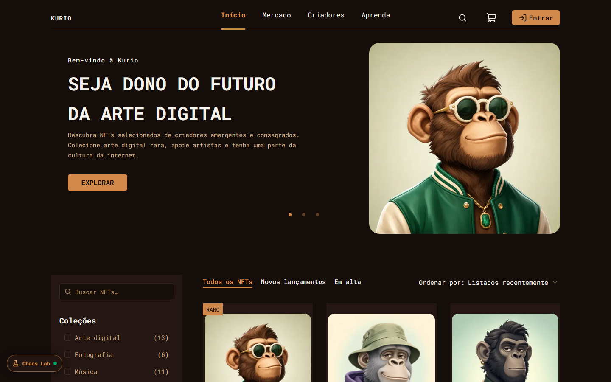
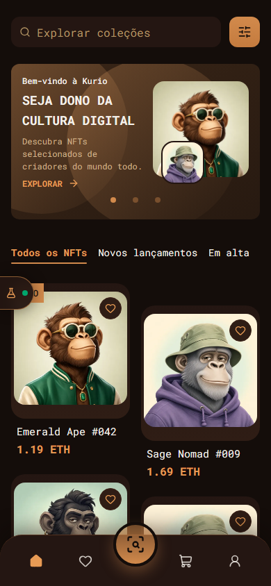

# KURIO — Marketplace de NFTs

Solução do **Desafio Frontend da Jungle Gaming**: o marketplace KURIO implementado a partir do Figma
em React + TypeScript, com backend simulado (REST + Socket.IO via MSW), testes E2E e de regressão
visual (Playwright) e auditoria Lighthouse automatizada.

- **Demo:** _adicione aqui a URL do deploy na Vercel_
- **Arquitetura e decisões:** [ARCHITECTURE.md](ARCHITECTURE.md)
- **Resultados do Lighthouse:** [lighthouse/RESULTADOS.md](lighthouse/RESULTADOS.md)

<p>
  
  
</p>

## Destaques

- **As 9 telas do Figma em desktop e mobile:** Início, Detalhe, Carrinho, Pagamento, Confirmação,
  Login, Cadastro, Perfil e Carteiras, além de Favoritos, recibo da transação e estados de vazio,
  erro, carregamento e 404.
- **Backend simulado completo:** contratos REST tipados com Zod, compartilhados entre cliente e
  mocks, e um servidor Socket.IO de verdade para o `socket.io-client`, emitindo `nft.updated` e
  `order.updated`. São 15 cenários reprodutíveis: rede lenta, 5xx, offline, sessão expirando, preço
  mudando no checkout, pagamento recusado, timeout e outros.
- **Chaos Lab (diferencial):** um painel dentro do app (`Alt+Shift+C`) para trocar cenários, injetar
  eventos de mercado, reenviar eventos duplicados ou antigos e derrubar o socket ou o servidor. Um log
  mostra como o cliente classificou cada evento (aplicado, duplicado, antigo, de outro usuário,
  inválido).
- **Robustez:** checkout idempotente (`Idempotency-Key`), validação final da cotação no servidor,
  reconciliação REST ↔ Socket por versão, atualizações otimistas com rollback, cache isolado por
  usuário (sem vazamento na troca de conta) e retomada de fluxo após expiração da sessão.
- **Qualidade:** TypeScript estrito, ESLint (com jsx-a11y), 52 testes Playwright rodando em desktop e
  mobile (com regressão visual) e Lighthouse com Acessibilidade, Boas práticas e SEO entre 97 e 100.

## Stack

| Área        | Tecnologia                                                                |
| ----------- | ------------------------------------------------------------------------- |
| Base        | React 19, TypeScript 6 (strict), Vite 8                                   |
| Rotas       | TanStack Router (file-based, code splitting automático, loaders e guards) |
| Dados       | TanStack Query 5, Axios, Zod 4 (contratos), big.js (valores em ETH)       |
| Tempo real  | Socket.IO (`socket.io-client`)                                            |
| UI          | Tailwind CSS 4, shadcn/ui (Radix), lucide-react, sonner                   |
| Formulários | React Hook Form + Zod                                                     |
| Mocks       | MSW 2 (REST via Service Worker) + `@mswjs/socket.io-binding` (Socket.IO)  |
| Testes      | Playwright (E2E + regressão visual, desktop e mobile)                     |
| Performance | Lighthouse 13 (script próprio com medianas)                               |

## Como rodar

Pré-requisitos: **Node.js 20.19 ou superior** (testado com 22.13) e npm 10. Para o Lighthouse, um
Chrome ou Chromium instalado.

```bash
git clone https://github.com/coder-gaia/frontend-challenge-jungle.git
cd frontend-challenge-jungle
npm ci
npm run dev        # http://localhost:5173, com o backend simulado ligado
```

O `.env` versionado já liga os mocks, e nenhuma variável é secreta. Para sobrescrever algo
localmente, crie um `.env.local`. Os dados do backend simulado ficam no `localStorage` do navegador:
reinicie tudo com `?mockReset=1` ou pelo Chaos Lab.

### Variáveis de ambiente

| Variável                | Padrão                      | Descrição                                                                                        |
| ----------------------- | --------------------------- | ------------------------------------------------------------------------------------------------ |
| `VITE_ENABLE_MOCKS`     | `true`                      | Liga o backend simulado (MSW para REST e Socket.IO). A demo publicada usa mocks.                 |
| `VITE_API_URL`          | `/api`                      | Base da API REST consumida pelo Axios.                                                           |
| `VITE_SOCKET_URL`       | `wss://realtime.kurio.mock` | Endpoint do Socket.IO. Com os mocks ligados, ele é interceptado e nenhuma conexão real é aberta. |
| `VITE_ENABLE_CHAOS_LAB` | `true`                      | Mostra o Chaos Lab (só quando os mocks estão ligados).                                           |

## Contas e dados de teste

| Conta      | E-mail            | Senha        | Situação inicial                 |
| ---------- | ----------------- | ------------ | -------------------------------- |
| Ana Souza  | `ana@kurio.dev`   | `Kurio@2026` | 2 carteiras (Ethereum e Polygon) |
| Bruno Lima | `bruno@kurio.dev` | `Kurio@2026` | 1 carteira (Ethereum)            |

Também dá para criar contas novas em `/cadastro`; elas ficam salvas no navegador. As telas de login
e cadastro mostram as credenciais de demonstração.

| Cupom       | Efeito                                           |
| ----------- | ------------------------------------------------ |
| `KURIO10`   | 10% de desconto                                  |
| `GENESIS`   | 0.05 ETH de desconto em pedidos acima de 0.5 ETH |
| `VERAO2025` | Expirado: demonstra o erro de cupom vencido      |

O catálogo tem 60 NFTs gerados de forma determinística. Os 9 primeiros são os NFTs desenhados no
Figma, com nome, arte e preço iguais aos do arquivo.

## Cenários do backend simulado

**Para selecionar um cenário**, use uma destas opções:

- **URL:** abra qualquer página com `?scenario=<id>`, por exemplo
  `http://localhost:5173/?scenario=payment-declined`. O parâmetro é aplicado e some da barra.
- **Chaos Lab:** botão flutuante no canto da tela ou `Alt+Shift+C`.
- **Console do navegador:** `__KURIO_MOCK__.setScenario('payment-declined')`.
- **Playwright:** a fixture `mockOptions` grava o cenário antes do carregamento (ver
  `tests/fixtures.ts`).

**Para resetar**, abra `?mockReset=1`, use o botão de reset no Chaos Lab ou rode
`__KURIO_MOCK__.reset()`. Banco, sessões e cenário voltam ao estado inicial. A latência também
pode ser trocada sozinha com `?mockLatency=instant|realistic|slow|chaotic`.

| Cenário (`id`)          | O que acontece                                                                               |
| ----------------------- | -------------------------------------------------------------------------------------------- |
| `default`               | Latência realista (60–220 ms) e tudo com sucesso                                             |
| `slow-network`          | Respostas entre 1,6 e 2,6 s, para ver skeletons e estados de carregamento                    |
| `flaky-network`         | Latência bimodal (40 ms a 2,2 s) com seed fixa: as respostas chegam fora de ordem            |
| `offline`               | Toda requisição falha na camada de rede e o Socket.IO não conecta                            |
| `server-errors`         | `GET /nfts` responde 503 nas 4 primeiras tentativas (esgota os retries) e se recupera depois |
| `empty-catalog`         | A listagem não retorna resultados                                                            |
| `session-expiring`      | Novas sessões expiram em 45 s                                                                |
| `payment-declined`      | O pedido é criado como pendente e o pagamento é recusado                                     |
| `order-timeout`         | A primeira tentativa cria o pedido mas não responde a tempo; o retry recupera o mesmo pedido |
| `checkout-price-change` | Poucos segundos depois de abrir o checkout, o preço do primeiro item sobe 8% (evento + REST) |
| `checkout-sold-out`     | Poucos segundos depois de abrir o checkout, a edição do primeiro item esgota                 |
| `wallet-rejected`       | A conexão da carteira é recusada                                                             |
| `favorites-failure`     | Incluir ou remover favoritos responde 503 (rollback da atualização otimista)                 |
| `realtime-down`         | O servidor Socket.IO recusa conexões; a UI mostra a reconexão e segue via REST               |
| `live-market`           | Preços oscilam a cada 8 s via `nft.updated`; catálogo, detalhe e carrinho reagem             |

## Como reproduzir os fluxos de falha

Os roteiros usam a conta `ana@kurio.dev` e o NFT `/nft/emerald-ape-042`. Os comandos
`__KURIO_MOCK__` rodam no console do navegador.

| Fluxo                              | Como reproduzir                                                                                                                                                                              | Comportamento esperado                                                                                                      |
| ---------------------------------- | -------------------------------------------------------------------------------------------------------------------------------------------------------------------------------------------- | --------------------------------------------------------------------------------------------------------------------------- |
| Pagamento recusado                 | `?scenario=payment-declined`, adicione um NFT ao carrinho e conclua o pagamento                                                                                                              | O pedido fica "processando" por cerca de 2,5 s e passa a "recusado". Os itens continuam no carrinho e a reserva é devolvida |
| Timeout na criação do pedido       | `?scenario=order-timeout` e confirme a compra                                                                                                                                                | A primeira tentativa estoura o timeout (8 s). O retry com a mesma `Idempotency-Key` recupera o mesmo pedido, sem duplicar   |
| Clique duplo em "Confirmar compra" | Clique várias vezes seguidas no botão                                                                                                                                                        | Um único pedido é criado                                                                                                    |
| Preço muda durante o checkout      | `?scenario=checkout-price-change` e abra `/pagamento`                                                                                                                                        | O resumo atualiza (destaque e aviso) e a confirmação exige nova revisão                                                     |
| Cotação desatualizada sem evento   | Em `/pagamento`, abra a revisão do pedido. Com ela aberta, rode `__KURIO_MOCK__.realtime.drop(20000)` e depois `__KURIO_MOCK__.market.changePrice('emerald-ape-042', 10)`. Confirme a compra | O servidor responde 409 `QUOTE_STALE`, e a UI mostra os valores antigos e novos e pede nova confirmação                     |
| Edição esgota                      | `?scenario=checkout-sold-out` e abra `/pagamento`, ou rode `__KURIO_MOCK__.market.setAvailability('emerald-ape-042', 0)`                                                                     | O item fica marcado como esgotado e a compra é bloqueada até ele ser removido                                               |
| Sessão expira no meio do fluxo     | `?scenario=session-expiring` (sessões de 45 s) ou "expirar sessão" no Chaos Lab, e continue navegando em `/pagamento`                                                                        | O app leva ao login com aviso e, depois de entrar, volta para `/pagamento` com o formulário preenchido                      |
| Carteira recusa a conexão          | `?scenario=wallet-rejected` e tente conectar uma carteira (em Conta → Carteiras ou no checkout)                                                                                              | Uma mensagem de recusa aparece e a compra não é enviada sem carteira conectada                                              |
| Falha ao favoritar                 | `?scenario=favorites-failure` e clique no coração de um NFT                                                                                                                                  | O ícone muda na hora (otimista) e volta ao estado anterior com um aviso de erro                                             |
| Erros 5xx no catálogo              | `?scenario=server-errors`                                                                                                                                                                    | O cliente tenta de novo com backoff, mostra o erro com "Tentar novamente" e se recupera na nova tentativa                   |
| Sem conexão                        | `?scenario=offline`, depois volte ao cenário padrão pelo Chaos Lab                                                                                                                           | Erros de rede com ação de nova tentativa; a recuperação funciona sem recarregar a página                                    |
| Tempo real fora do ar              | `?scenario=realtime-down`, ou derrube a conexão pelo Chaos Lab                                                                                                                               | O header indica a reconexão, o REST continua funcionando e o pedido pendente é resolvido por polling                        |
| Eventos duplicados ou antigos      | No Chaos Lab, reenvie o último evento ou envie um evento antigo                                                                                                                              | O log do Chaos Lab mostra `duplicate` ou `stale` e a UI não muda                                                            |
| Troca de usuário                   | Entre como Ana, favorite itens e monte um carrinho; saia e entre como Bruno                                                                                                                  | Nada da Ana aparece para o Bruno: carrinho, favoritos, pedidos e eventos ficam isolados                                     |
| Respostas fora de ordem            | `?scenario=flaky-network` e digite rápido na busca ou troque filtros                                                                                                                         | A grade sempre mostra o resultado da última busca                                                                           |

## Comandos

| Comando                    | O que faz                                                              |
| -------------------------- | ---------------------------------------------------------------------- |
| `npm run dev`              | Servidor de desenvolvimento com mocks (http://localhost:5173)          |
| `npm run build`            | Typecheck e build de produção em `dist/`                               |
| `npm run preview`          | Serve o build (http://localhost:4173)                                  |
| `npm run typecheck`        | `tsc -b` em todo o projeto                                             |
| `npm run lint`             | ESLint                                                                 |
| `npm run format`           | Prettier (`format:check` só verifica)                                  |
| `npm run test:e2e`         | Playwright em desktop e mobile; faz o build e sobe o preview sozinho   |
| `npm run test:e2e:desktop` | Só o projeto desktop (1440 × 900)                                      |
| `npm run test:e2e:mobile`  | Só o projeto mobile (Pixel 7, 390 × 844)                               |
| `npm run test:visual`      | Só a regressão visual (`test:visual:update` regenera as baselines)     |
| `npm run test:report`      | Abre o relatório HTML do Playwright                                    |
| `npm run lighthouse`       | Build e auditoria completa (`lighthouse:run` audita o build existente) |
| `npm run images`           | Regenera as imagens WebP a partir das artes do Figma (`assets/nfts`)   |

## Testes E2E (Playwright)

```bash
npx playwright install chromium   # só na primeira vez
npm run test:e2e
npm run test:report               # relatório HTML com traces, vídeos e screenshots das falhas
```

- Dois projetos: **desktop** (1440 × 900) e **mobile** (Pixel 7). Os mesmos 52 testes rodam nos
  dois. 8 deles (navegação por teclado e larguras controladas pelo próprio teste) só fazem sentido no
  desktop e são pulados no mobile.
- Os testes usam o build de produção (`npm run build && npm run preview`) e controlam o backend
  simulado pela fixture `mock` (cenários, eventos de mercado, queda do socket, expiração de sessão).
  Os eventos chegam ao app pelo servidor Socket.IO simulado, sem atalhos no cache.
- Em caso de falha ficam guardados trace, vídeo e screenshot (`test-results/`). Para abrir um trace:
  `npx playwright show-trace test-results/<teste>/trace.zip`.
- Regressão visual: início, detalhe, carrinho e pagamento, em desktop e mobile. As baselines ficam em
  `tests/__screenshots__` e levam o sistema operacional no nome (as versionadas foram geradas no
  Windows). Em outro sistema, gere as suas com `npm run test:visual:update`.

| Arquivo                       | Cobertura                                                                                                                                               |
| ----------------------------- | ------------------------------------------------------------------------------------------------------------------------------------------------------- |
| `catalog.spec.ts`             | Filtros combinados na URL e no histórico, busca, estado vazio, respostas fora de ordem e catálogo vazio                                                 |
| `nft-detail.spec.ts`          | Acesso direto, galeria, edições, limite de quantidade, edição indisponível e 404 (do NFT e global)                                                      |
| `auth.spec.ts`                | Cadastro com validação e conflito, login inválido, retomada de fluxo, expiração, logout e troca de usuário                                              |
| `favorites.spec.ts`           | Exigência de login, atualização otimista persistida e rollback na falha                                                                                 |
| `cart.spec.ts`                | Quantidades, remoção com desfazer, cupons, persistência, carrinho de visitante e mudanças de preço e estoque em tempo real                              |
| `purchase.spec.ts`            | Compra completa até o recibo, com snapshot imutável e confirmação só após o pedido ser confirmado                                                       |
| `payment-failures.spec.ts`    | Pagamento recusado, cliques repetidos, timeout com idempotência e carteira recusada                                                                     |
| `realtime.spec.ts`            | Preço mudando no checkout, cotação desatualizada, eventos duplicados ou antigos, queda do socket e refresh com pedido pendente, evento de outro usuário |
| `account.spec.ts`             | Perfil com erros do servidor, avatar redimensionado, troca de senha e carteiras com validação e conflito                                                |
| `a11y-and-states.spec.ts`     | Skip link, foco em diálogos, busca e login por teclado, regiões vivas, skeletons, 5xx com retry e offline                                               |
| `responsive.spec.ts`          | Ausência de overflow horizontal das telas principais em 390, 768 e 1440 px                                                                              |
| `visual/pages.visual.spec.ts` | Regressão visual                                                                                                                                        |

## Lighthouse

```bash
npm run lighthouse
# Se o Chrome não for encontrado automaticamente:
CHROME_PATH="/caminho/para/chrome" npm run lighthouse
```

- Mede o build de produção servido por `vite preview`, com os mocks no cenário padrão, em 3 execuções
  por página (início e detalhe) e por perfil (mobile e desktop). Cada execução usa um perfil limpo do
  Chrome. A configuração está versionada em [`lighthouse/config.mjs`](lighthouse/config.mjs).
- Saída em `lighthouse/reports/`: os JSON de todas as execuções, o HTML da execução mediana e o
  `summary.json`, com versões, máquina e condições. O resumo em Markdown fica em
  [`lighthouse/RESULTADOS.md`](lighthouse/RESULTADOS.md).

| Página  | Perfil  | Performance | Acessibilidade | Boas práticas | SEO |    LCP | CLS |    TBT |
| ------- | ------- | ----------: | -------------: | ------------: | --: | -----: | --: | -----: |
| Início  | mobile  |          78 |            100 |           100 | 100 | 3.95 s |   0 | 217 ms |
| Início  | desktop |          99 |            100 |           100 | 100 | 0.86 s |   0 |   0 ms |
| Detalhe | mobile  |          83 |             97 |           100 | 100 | 3.55 s |   0 | 176 ms |
| Detalhe | desktop |          99 |            100 |           100 | 100 | 0.79 s |   0 |   0 ms |

A performance mobile ficou abaixo da meta de 90. A justificativa completa está em
[ARCHITECTURE.md § 13](ARCHITECTURE.md#13-performance-e-lighthouse). Em resumo: o app é renderizado
só no cliente, com a stack obrigatória no caminho crítico; o backend simulado roda dentro da página
(Service Worker do MSW); e no layout mobile o LCP é a imagem do primeiro card, que depende da API.
CLS (0), TBT (abaixo de 220 ms) e as demais categorias estão dentro das metas. O próximo passo para o
mobile é SSR ou prerender da página inicial.

## Deploy (Vercel)

O app é estático: o backend simulado roda no navegador, então não há servidor para publicar.

1. Em [vercel.com/new](https://vercel.com/new), importe o repositório `coder-gaia/frontend-challenge-jungle`.
2. O preset **Vite** é detectado: build `npm run build`, saída `dist`. As variáveis já vêm do `.env`.
3. Clique em **Deploy**. O [`vercel.json`](vercel.json) faz o rewrite das rotas da SPA para o
   `index.html` e define o cache dos assets com hash, das imagens e da fonte. O `mockServiceWorker.js`
   não é cacheado, para o worker sempre atualizar.

Pela CLI: `npx vercel` (preview) ou `npx vercel --prod`.

## Estrutura

```
src/
├── api/         cliente HTTP, QueryClient e query keys
├── contracts/   schemas Zod e rotas REST/eventos (compartilhados com os mocks)
├── features/    um diretório por domínio: catalog, nft, cart, checkout, orders, auth, account, realtime, devtools…
├── mocks/       backend simulado: handlers, serviços, banco, fixtures, Socket.IO e cenários
├── routes/      rotas file-based (TanStack Router)
└── components/  layout e componentes de UI (shadcn/ui)
tests/           Playwright (e2e/ e visual/)
lighthouse/      configuração, relatórios e resultados
scripts/         auditoria Lighthouse e geração de imagens
```

Os detalhes de contratos, sessão, carrinho, cache, reconciliação, decisões de UX, desvios do Figma e
limitações estão em [ARCHITECTURE.md](ARCHITECTURE.md).
